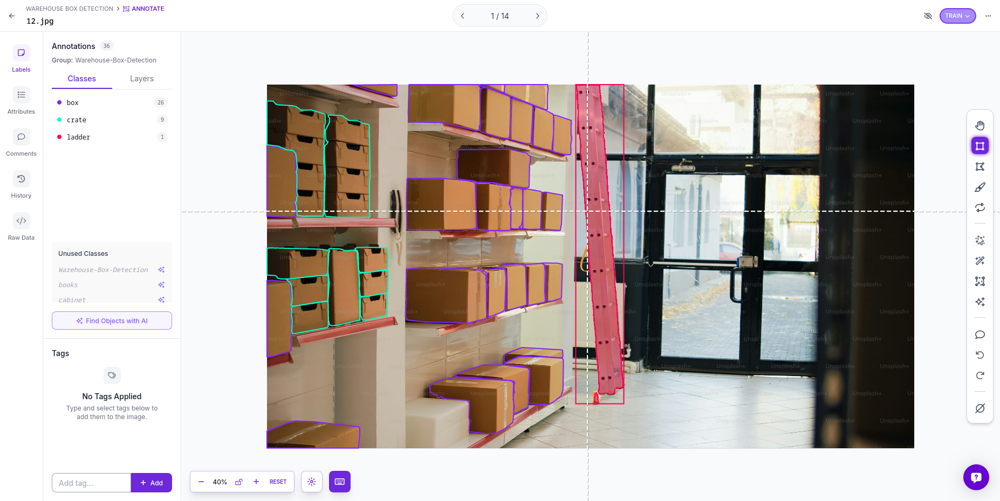

# Warehouse Fulfillment Data Auditing & Annotation Project

A data-centric quality assurance and image auditing project simulating the workflows used to maintain stow quality, inventory tracking accuracy, and defect reduction in automated fulfillment centers.

## 📦 Project Context
In high-scale logistics, automated computer vision systems rely heavily on precision human judgment to correct errors, verify item locations, and handle edge cases. This project focuses on auditing and precisely labeling warehouse assets across 14 environment samples using strict data-entry standards.

## 🏷️ Asset Tracking Breakdown
- **Target Operations:** Inventory Tracking & Space Management
- **Audit Categories (Classes):** `Inventory Box`, `Storage Shelf Space`

## 🔍 Core Audit Methodology & Defect Reduction Standards
To ensure high-fidelity inputs that prevent system blind spots, the following operational guidelines were strictly applied during image parsing:

1. **Precision Bounding Box Alignment:** Frames were analyzed to ensure bounding boxes perfectly captured object boundaries with zero pixel leakage into background noise. This directly mimics operational metrics required for high-accuracy inventory counting.
2. **Occlusion Management (Handling Blocked Items):** For overlapping items or boxes obscured by warehouse structural frames, judgment was applied to mark only the visible, active surface areas to keep classification inputs clean.
3. **Low-Visibility Context Parsing:** Audited frames included various angles and simulated blurry/low-light shelf conditions to practice identifying package profiles in suboptimal environment settings.

## 📉 Data Analysis & Scalability Framework
- **Operational Reality:** A 14-image batch acts as a baseline validation loop.
- **Scaling Action Plan:** To meet production standards for active tracking, the dataset would be expanded to include hundreds of human-verified entries focusing on damaged packaging profiles, multi-tier shelf stacking variations, and swift transit blur corrections.

